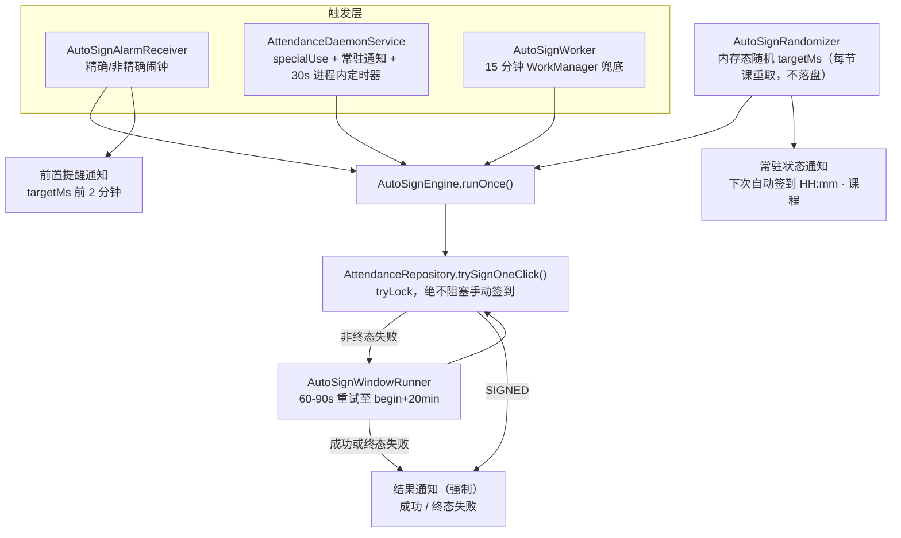

# 后台自动签到（随机时刻 + 常驻通知 + 保活引导）

## 目标

- 每节课在 **[开课前 15 分钟, 开课时刻]** 内随机取一个时刻签到。随机值**只在内存中存活，绝不落盘**，且**每节课（每次课次）重新随机**，避免留下可被识别的固定模式。
- 多路触发保证准时：精确闹钟 / 前台服务进程内定时器 / WorkManager 兜底。
- **通知栏常驻通知**：展示自动签到正在运行，并明确写出「下次自动签到：HH:mm · 课程名」。
- **签到前**：**开课前 15 分钟**发一条提醒，明确告知将在什么时刻、为哪门课自动签到。
- **签到后必须通知**：自动签到的结果通知**不受「签到通知」开关影响**。
- 失败兜底：窗口内每 60–90 秒重试，直到成功或超过**开课后 20 分钟**上限，最终只发一条结果通知。
- 设置页给出**可点击的保活引导**：关闭省电策略（直接弹豁免授权框）、允许自启动、锁定后台（防被杀）。
- **手动签到（App 按钮 / 小部件按钮）行为与文案完全不变。**

## 现状要点（已核实）

- `attendance/AttendanceScheduler.kt` 内 `AutoSignWorker` 已是自动签到执行体，但只靠 15 分钟 `PeriodicWorkRequest`，无窗口对齐、无网络约束。
- `attendance/AttendanceForegroundService.kt` 目前只是「挂一个常驻通知」，没有实际工作，且用的是 `dataSync` 类型。
- `attendance/AttendanceRepository.kt:40` `signOneClick` 用 `signMutex.withLock` + `inFlightCourseId`，并发时会抛 `ApiException("SIGN_IN_PROGRESS")`。
- `course/CourseRepository.kt` 已有 `parseBeginMs/parseEndMs/currentAndNext/isInSignWindow`。
- `widget/VendorRom.kt:31` 已有 `family()` 六档 ROM 识别与 `openAutoStartSettings()`（5 大国产 ROM 自启动页），可直接复用。
- `widget/WidgetRefreshWorker.kt:211` 演示了 `AlarmManager.setAndAllowWhileIdle` 的用法。
- `QingxinApp.kt:98` 手工依赖容器，后台可访问加密会话。
- 当前 Manifest **没有** `REQUEST_IGNORE_BATTERY_OPTIMIZATIONS`，也没有 `SCHEDULE_EXACT_ALARM`。

## 已核实的两项系统限制（决定本方案的服务类型）

- Android 15（targetSdk 35）下 `dataSync` 前台服务有 **24 小时内共 6 小时**配额，超时后系统调用 `onTimeout` 并要求停止；配额耗尽后再启动会抛 `ForegroundServiceStartNotAllowedException`。**因此 `dataSync` 无法支撑 24 小时常驻通知。**
- Android 15 下 `BOOT_COMPLETED` 接收器**禁止**启动 `dataSync`/`camera`/`mediaPlayback`/`phoneCall`/`mediaProjection`/`microphone` 类型的前台服务，但 `**specialUse` 不在禁止名单内**。即当前 `BootReceiver` + `dataSync` 在 Android 15 上本来就会抛异常。
- 结论：主服务改用 `**specialUse**`（无时长上限、无运行时前置条件、允许开机启动）。本项目通过 GitHub 侧载分发，不涉及 Play 审核。

## 架构

## 实施步骤

### 1. 随机时刻：`attendance/AutoSignRandomizer.kt`（内存态、不落盘）

- `object AutoSignRandomizer`，持有 `ConcurrentHashMap<String, Long>`，key = `"$courseId@$yyyyMMdd"`，value = 该课次的 `targetMs`。
- `fun targetMsFor(course, beginMs, nowMs): Long`
  - 若已存在 value → **原样返回**（保证同一进程内闹钟、前台服务、Worker 三路看到同一个时刻，不会来回滑动）。
  - 否则新取：`lower = max(beginMs - WINDOW_LEAD_MS, nowMs + 30_000)`、`upper = beginMs - 30_000`（`WINDOW_LEAD_MS = 15 * 60_000L`）。
    - `upper <= lower` → 返回 `beginMs`（窗口即将结束，只能立刻签）。
    - 否则 `lower + Random.nextLong(upper - lower)`，均匀分布。
  - **不写任何 SharedPreferences / 文件**：进程重启后重新随机，且每个新课次（key 含日期）都重新随机。
- `fun clear(courseId, day)` / `fun pruneBefore(day)`：跨天或课次结束后清理，避免 map 无限增长，并确保下一节课重新随机。
- `fun deadlineMs(beginMs) = beginMs + 20 * 60_000L`。
- 注意：随机值只在内存 → 进程被杀后重启会在剩余窗口内重取，新值必然 `<= beginMs`，不会滑出签到窗口；此时需同步刷新常驻通知里的时刻。

### 2. 关键改动：`attendance/AttendanceRepository.kt` 增加非阻塞入口

- **保留 `signOneClick(course)` 原样不动**，手动链路零影响。
- 新增：
  - `fun isSigningNow(): Boolean = inFlightCourseId != null`
  - `suspend fun trySignOneClick(course: Course): SignResult?`
    - 用 `signMutex.tryLock()`；抢不到则 `delay(500)` 重试至多 3 秒，仍抢不到返回 `null`（用户正在手动签到，自动路径**主动让路**）。
    - 内部抽出 `private suspend fun doSign(course)` 与 `signOneClick` 共用，保证两条路径行为完全一致。
    - `finally { signMutex.unlock() }`，`inFlightCourseId` 的置空放在 `doSign` 的 `finally` 中。

### 3. 执行引擎：`attendance/AutoSignEngine.kt`

- `suspend fun runOnce(context, app): EngineOutcome`
  1. 守卫：`app.isReady`、`settings.autoSignEnabled`、`authRepository.isLoggedIn()`。
  2. `courseRepository.loadToday()`，必要时刷新。
  3. `schoolNow = qrTimeline.currentSchoolTimeOrNull() ?: qrTimeline.syncClock().schoolNowMs`。
  4. 筛出**该签**的课：`!signed`、`beginMs` 可解析、`randomizer.targetMsFor(...) <= schoolNow`、`schoolNow <= deadlineMs`；按 `targetMs` 升序，只处理第一个。
  5. 调 `attendanceRepository.trySignOneClick(course)`：
    - `null` → 用户正在手动签到，本轮退出（不发通知）。
    - `SIGNED` → `randomizer.clear(...)`，发**强制成功通知**，`courseRepository.loadToday()`，`TodayCourseWidgetReceiver.requestUpdate()`，刷新常驻通知。
    - `QR_EXPIRED` / `OUTSIDE_SIGN_WINDOW` / `SIGN_RESULT_UNKNOWN` → 视为**非终态**进入重试；超过 `deadlineMs` 则**终态失败**并发强制失败通知。
  6. `ApiException` 为 `LOGIN_EXPIRED/LOGIN_REJECTED` → 发登录失效通知（强制）并 `attendanceScheduler.stop()`。
- `object AutoSignWindowRunner`：进程内重试循环，`suspend fun ensureRunning(context)`，`Mutex` 保证同时只有一个循环；循环体 = `runOnce()` → 未成功则 `delay(Random.nextLong(60_000, 90_000))`，直到成功或超过 `deadlineMs`。
  - 重试**不走闹钟**（Doze 下 `setAndAllowWhileIdle` 最小间隔约 9 分钟），只跑在进程内（守护服务协程）与 15 分钟 Worker 到达时。
- 结果去重：内存 map 记录「本课次已发过结果通知」，保证每节课只推一条结果。

### 4. 常驻通知 + 前置提醒 + 强制结果通知

改造 `attendance/AttendanceNotifier.kt`（新增方法，**不动**现有 `notifySuccess/notifyFailure/...` 的语义与开关逻辑）：

- **新增渠道** `auto_sign_status`（`IMPORTANCE_LOW`，静默、不打扰）用于常驻通知；现有 `attendance`（`IMPORTANCE_DEFAULT`）继续用于手动结果、自动结果与前置提醒。
  - 注意渠道重要性创建后不可更改，因此必须用新的 channel id。
- `fun updateDaemonStatus(nextLabel: String?)`：常驻通知内容按状态切换
  - 今日有未签课程 → 标题「自动签到运行中」，正文「下次自动签到：HH:mm · 课程名」
  - 今日课程已全部签完 → 「今日课程已全部签到完成」
  - 今日无课 → 「今日无课程，待命中」
  - 未登录 → 「请打开应用登录，自动签到才能生效」
  - 通知用 `setOngoing(true)` + `setOnlyAlertOnce(true)` + `setShowWhen(false)`，点击打开 `MainActivity`。
  - 刷新时机：随机时刻确定/变化时、签到成功时、课程刷新后、开关变化时、跨天时。
- `fun notifyAutoSignUpcoming(courseName: String, targetMs: Long)`：**签到前提醒**，正文「将在 HH:mm 为《课程名》自动签到」，由 `targetMs - 2 分钟` 的闹钟触发。
- `fun notifyAutoSignResult(success: Boolean, courseName: String, detail: String)`：**强制通知**，内部**不检查 `notifyEnabled`**（仅检查 `POST_NOTIFICATIONS` 权限）。
  - 成功 → 「自动签到成功」+「《课程名》HH:mm 已自动签到」
  - 终态失败 → 「自动签到失败」+ 原因 +「请手动签到」
- 手动路径的 `notifySuccess/notifyFailure` 仍由 `notifyEnabled` 控制，**行为不变**。

### 5. 前台服务改造：`attendance/AttendanceDaemonService.kt`

- 由现有 `AttendanceForegroundService` 重命名/改造而来：
  - `onStartCommand` 用 `startForeground(ID, notification, FOREGROUND_SERVICE_TYPE_SPECIAL_USE)`，通知即第 4 节的常驻状态通知。
  - 持有长生命周期 `CoroutineScope(SupervisorJob() + Dispatchers.Default)`，每 30 秒检查「是否有课次的 `targetMs` 已到」，命中则 `AutoSignWindowRunner.ensureRunning()`；并在时刻变化时刷新常驻通知。这是进程存活时**最精确**的一路。
  - `onDestroy` 取消协程；`START_STICKY`。
  - 启动处全部 `runCatching`，捕获 `ForegroundServiceStartNotAllowedException` 并降级为「不常驻、仅靠闹钟 + Worker」。
- `BootReceiver` 改为启动新服务（`specialUse` 允许在 `BOOT_COMPLETED` 中启动），仍保留 `try/catch` 兜底。

### 6. 多路触发

- 新增 `attendance/AutoSignAlarmReceiver.kt`（action `ACTION_AUTO_SIGN_ALARM`，`exported=false`，显式 `PendingIntent`）：`goAsync()` + IO 协程调 `AutoSignEngine.runOnce()`，随后 `ensureAlarm()` 续排、`AutoSignWindowRunner.ensureRunning()`。
- `AttendanceScheduler` 新增闹钟管理（参考 `widget/WidgetRefreshWorker.kt:211`）：
  - `ensureAlarm()`：取当日未签课次的最小 `targetMs`，`canScheduleExactAlarms()` 为真时用 `setExactAndAllowWhileIdle`；否则用 `setAndAllowWhileIdle`，并把触发点前移到 `**beginMs - WINDOW_LEAD_MS**`（宁可早于随机点，也不能晚到窗口之外）。
  - 另排两个闹钟：**前置提醒**（`targetMs - 2min`）与**窗口兜底**（`beginMs`，覆盖 Doze 错过随机点）。
  - `cancelAlarm()` / `rescheduleAlarm()` 与 `stop()` 联动。
- 改造 `AutoSignWorker`：逻辑改为直接调 `AutoSignEngine.runOnce()`（删掉现有临时挑选 `currentAndNext` 的代码），`PeriodicWorkRequest` 加 `.setConstraints(NetworkType.CONNECTED)`。

### 7. Manifest 与权限

- `AttendanceDaemonService`：`android:foregroundServiceType="specialUse"`，并加
`<property android:name="android.app.PROPERTY_SPECIAL_USE_FGS_SUBTYPE" android:value="scheduled_auto_checkin_daemon" />`
- 新增权限：`FOREGROUND_SERVICE_SPECIAL_USE`、`REQUEST_IGNORE_BATTERY_OPTIMIZATIONS`、`SCHEDULE_EXACT_ALARM`。
- `FOREGROUND_SERVICE_DATA_SYNC` 保留（WorkManager 合并声明可能仍需要），但不再有服务使用它。
- 注册 `AutoSignAlarmReceiver`。

### 8. 保活引导（设置页新卡片）

- 新增 `attendance/KeepAliveHelper.kt`：
  - `isBatteryExempt(context)`（`PowerManager.isIgnoringBatteryOptimizations`）
  - `requestBatteryExemption(activity)` → `ACTION_REQUEST_IGNORE_BATTERY_OPTIMIZATIONS` + `package:` URI；失败回退 `ACTION_IGNORE_BATTERY_OPTIMIZATION_SETTINGS` / `VendorRom.openAppDetails`
  - `canScheduleExactAlarms(context)` + `openExactAlarmSettings(activity)`
  - `hasNotificationPermission(context)`
  - `lockInRecentsGuide(context): Int`，复用 `widget/VendorRom.kt:31` 的 `family()` 做 ROM 分支
- `ui/MainActivity.kt`：在「签到偏好」卡片之后、「桌面小部件」卡片之前插入新 `item { Card(...) }`，结构照抄现有小部件卡片（`LocalContext.current as? ComponentActivity` + `OutlinedButton` + `AlertDialog`）：
  - 状态行（红/绿）：省电豁免、自启动、精确闹钟、**通知权限**（通知权限尤其关键：被拒时常驻通知与结果通知都不会显示）。若自动签到已开启但省电未豁免/通知被拒，卡片顶部加醒目告警文案。
  - 按钮：`关闭省电策略`、`允许自启动`（`WidgetPinHelper.openAutoStart`）、`锁定后台（图文步骤）`、`允许精确闹钟`（未授权时才显示）、`开启通知`（被拒时才显示）。
  - `锁定后台` 弹 `AlertDialog`，按 ROM 给出「最近任务 → 下拉/长按卡片 → 加锁」分步说明。
- `ui/MainViewModel.kt`：`AppUiState` 增加 `keepAlive: KeepAliveState`（5 个布尔），`refreshKeepAlive()` 在打开设置页与 `onResume` 时刷新；沿用 `AttendanceScheduler` 的 SharedPreferences 模式，不引入 DataStore。
- `res/values/strings.xml`：新增 `auto_sign_*` / `keepalive_*` 前缀文案（对齐现有 `widget_*` 命名与 ROM 后缀约定），含 `keepalive_lock_coloros/miui/vivo/harmony/samsung/aosp`。

### 9. 版本与文档

- `android-app/app/build.gradle.kts`：`versionCode 25` / `versionName "1.1.12"`。
- 构建 release，产物放 `releases/qingxin-signin-1.1.12-release.apk`；更新 `releases/README.md` 与 `README.md`（自动签到说明 + 常驻通知 + 保活四步引导）。

## 手动签到不受损的保证措施

- `signOneClick` 的签名、`withLock` 阻塞语义、UI 调用点（`MainViewModel.signSelected`、`WidgetUpdater.performSign`）全部不改。
- 自动路径使用 `trySignOneClick`（`tryLock`），抢不到锁时**主动放弃并让路**，用户不会看到 `SIGN_IN_PROGRESS`。
- 手动路径的通知仍受 `notifyEnabled` 控制，仅自动路径的结果通知被改为强制。
- 自动路径的重试上限（`begin + 20min`）与手动路径无关，手动路径仍不做本地窗口硬拦截。

## 验证

- 单元测试（`app/src/test`，`testDebugUnitTest` 已接入）：
  - `AutoSignRandomizer`：同一进程内多次调用返回相同 `targetMs`；`targetMs ∈ [beginMs-15min, beginMs]`；`clear/pruneBefore` 后重新随机；`nowMs` 已接近 `beginMs` 时返回 `beginMs` 且不越界。
  - 选课筛选纯函数：窗口内/窗口外/已签到/时间不可解析 四种输入取舍。
  - deadline 计算：`beginMs + 20min`。
- 手工回归清单（真机）：
  1. App 内「一键签到」按钮行为、文案、状态流转与 1.1.11 一致。
  2. 小部件「签到」按钮行为一致。
  3. 自动签到过程中手动连续点「一键签到」不出现 `SIGN_IN_PROGRESS`。
  4. 关闭自动签到开关后，闹钟/前台服务/Worker 全部停止（`dumpsys alarm | grep qingxin` 无残留），常驻通知消失。
  5. 构造一门「5 分钟后开课」的课：常驻通知出现并显示时刻 → 前置提醒出现 → 只成功签到一次 → 只收到一条结果通知。
  6. 关闭「签到通知」开关后，手动签到不再通知，但自动签到结果**仍然通知**。
- 构建校验：`./gradlew :app:testDebugUnitTest :app:assembleRelease` 全绿，`aapt dump badging` 确认 `versionCode=25 / 1.1.12`，`aapt dump xmltree AndroidManifest.xml` 确认服务类型为 `specialUse`。

