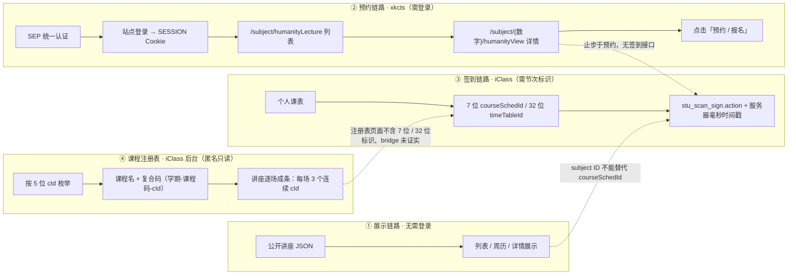

# 讲座「预约系统」与「打卡系统」是两套互不相通的东西

> **TL;DR**
> 讲座预约走 xkcts（列表 / 详情 / 听课记录），上课打卡走 iClass（`stu_scan_sign.action` + 7 位 `courseSchedId` + 服务器毫秒时间戳）。
> xkcts 的主键 `/subject/{4 位数字}` 只是展示元数据，**不能**当节次标识去签到。
> **本轮新增结论（见 §10）**：明德讲堂等讲座**确实存在于 iClass 的课程注册表**里（匿名只读目录），每场占 **3 个连续 5 位 `cId`**（三个校区各一个），且系列课程码跨学期稳定；但注册表页面**不暴露**任何 7 位 `courseSchedId` 或 32 位 `timeTableId`。
> 因此在「`cId` → 可签到标识」的 bridge 未被证实前，「课表之外的讲座」仍**无法自动签到**，闭环 = 公开列表展示 + 提醒 + 手动录入。

本文固化调研结论，供后续开发直接引用，**不再重复调研**。仅写路径与泛指，不写校内主机名 / 端口 / 完整 URL。

## 1. 两套系统对照

| 维度 | 讲座预约 / 报名（xkcts） | 上课打卡 / 考勤（iClass） |
| --- | --- | --- |
| 入口路径 | `/subject/humanityLecture`（列表）<br/>`/subject/{4 位数字}/humanityView`（详情）<br/>`/subject/humanityStudent`（听课记录） | `course/stu_scan_sign.action`（**唯一**签到入口） |
| 关键标识 | `subject` 数字 ID、期次号（如 `M1147`） | 7 位 `courseSchedId`；或 32 位 `timeTableId`（变体） |
| 时间参数 | 无 | 服务器毫秒时间戳（由 `common/get_timestamp.do` 校时得到） |
| 鉴权 | SEP 统一认证 → 门户跳转 → 站点登录 → `SESSION` Cookie | 会话 `sessionId` 请求头 |
| 有无签到 / 打卡动作 | **没有**（见 §4） | 有，且仅此一条 |

## 2. 三条链路的对应关系



## 3. xkcts 鉴权链路与阻断点

1. SEP 统一认证（图形验证码 + 密码加密提交）。
2. 门户站点返回跳转链接，携带一次性的 `Identity` 查询参数与 `roleId` 形式的学生角色。
3. 访问站点登录路径后，响应写入名为 `SESSION` 的 Cookie（值不予记录）；此后直接带它抓 HTML 列表。
4. 阻断点：**图形验证码**；**新设备可能还有邮箱验证**——已核实的开源实现明确要求人工在 headful 浏览器里完成一次验证。
5. 结论：该链路**不可无人值守地稳定复用**，也不值得为「只读列表」付出这个成本（公开 JSON 已能覆盖展示）。

## 4. 决定性结论：xkcts 没有签到接口

- 已核实的讲座类开源实现（Playwright 报名机器人、周历数据抓取脚本）**全程只做两件事**：「列出讲座」与「点击预约 / 报名」；**没有任何**打卡、刷卡、iClass 调用。
- 其公开讲座数据 JSON 中的字段集合为：
  `id / seriesName / title / creditHours / department / targetAudience / speaker / isAppointmentRequired / sourceUrl / startTimestamp / endTimestamp / rawTimeStr / mainVenue / parallelVenue / introduction / lastUpdatedAt`（人文源另有 `appointmentInfo`）。
  **零出现**任何签到相关字段（无 `courseSchedId`、无 `timeTableId`、无签到状态）。
- 因此：**xkcts 的 `subject` ID 不能替代 `courseSchedId` 去调签到接口。**

## 5. 主键 / 标识体系（最易混淆的一点）

| 标识 | 形态 | 归属 | 能否签到 |
| --- | --- | --- | --- |
| `subject` ID | `/subject/6960`，4 位数字 | **xkcts 系统主键** | 否 |
| 期次号 | `M1147` 形如 `M` + 数字，出现在标题 / 系列名里 | 仅是文案编号（与 `cId` 单调同向） | 否 |
| 前端字母码 | 8 位纯字母（A–P），由详情路径哈希得到 | 公开镜面**前端内部 ID** | 否 |
| `cId` | 5 位数字（全库 `10000`–`64298`，只增不改） | **iClass 课程注册表主键** | **未证实** |
| 复合码 | `10 位学期号-课程码-cId`，如 `2026202701-242624-64241` | 注册表展示用 | 否 |
| `courseSchedId` | 7 位数字 | iClass 节次标识 | **是** |
| `timeTableId` | 32 位十六进制 | iClass 节次标识变体 | **是** |

- 一期讲座**通常**对应 3 个连续 `subject` ID（对应三个校区 / 会场），例如 `6960 / 6961 / 6962` 同一时间、不同地点。
- 该「3 个一组」不是硬规则：已观察到同一场次出现 2 个或 5 个条目的情况（同一会场拆成多条 `subject`）。
- `subject` ID 只可用于**展示元数据、去重与拼详情路径**，与签到无关。
- 注册表侧同构：**每场讲座占 3 个连续 `cId`**（`中关村 / 雁栖湖 / 玉泉路` 各一个），系列课程码跨学期稳定（明德讲堂恒为 `242624`）。
- `cId` 与 `subject` ID 是**两套独立主键**，目前**没有任何已知映射**在二者之间（§10）。

## 6. iClass 侧

- 已核实的一批开源项目（含二维码解析类与自动签到类）**全部只有 `stu_scan_sign.action` 一条通道**。
- 节次标识一律来自**个人课表**（`courseSchedId` / `timeTableId`）或用户手动粘贴；在这些项目里搜不到任何讲座 / 人文 / 讲堂相关的桥接逻辑。
- 也就是说：**课表之外的讲座，在现有已知接口下无法自动签到。**

## 7. 旧报名接口（历史线索，不得当签到用）

- 早期教务脚本用过形如 `POST /subject/toSign` 并带 `lectureId`（等同 `subject` 数字）的调用；那是**预约报名**，不是考勤，且主机多为已过时的旧教务域。
- 可作为「xkcts 是否存在同名报名 API」的排查线索，**不得**当作签到接口使用。

## 8. 本项目的结论与分流

- **展示层**：改用公开讲座 JSON（无需登录、内容准确、字段稳定）。
- **签到层**：三条路，按优先级——
  1. 探针证明讲座会进 iClass 课表（带 7 位码）→ 开自动签到；
  2. 现场班牌 / 教室二维码读出 7 位编号 → 手动录入签到；
  3. 否则以「公开列表展示 + 提醒 + 手动录入」为**最终闭环**。

**已落地状态（截至 1.2.0，非待办）**：展示层读**学院网站的通知**（`LectureNoticeService`：RSS 优先、HTML 兜底，每次实时拉取、不落列表缓存），讲座页按「期次号」归并同一场讲座的预告与报道，并以**站内证据**（出现「报道」）标记「已结束」——不按当前日期猜；第三方公开 feed 与课表扫描路径都已下线（前者已停更，后者认不出讲座）。签到侧只保留**手动打卡**：它已独立成页（`SignCode` 全匹配校验 7 位 `courseSchedId` / 32 位 `timeTableId`），**路径 1 与自动签到仍未开启**，因为始终没有证据表明讲座会带 7 位码出现在 iClass 课表里（探针 A6/A7/B1/B2 全阴性）。另外，`cId`（5 位）→ 节次标识的 bridge 也**未被证实**，因此注册表只能用来回答「有新讲座、叫什么」（见哨兵）。

一条来自实测的重要限制：第三方公开数据源的快照**可能整体滞后**（实测曾停留在数月前的场次），学院网站的通知页也不带讲座时间。因此现在**没有一个源能同时给出「讲座日期 + 够新」**，界面只能按「有报道 ⇒ 已结束」这一半证据分流，并明确写出「没有这个标记不代表讲座还没开始」。

## 9. 对开发的具体约束

- 公开数据源条目**默认 `signable = false`**（无 `courseSchedId` / `timeTableId` 即为不可签到），界面须给出明确原因，而不是发出一次注定失败的请求。
- `subject` ID **仅作展示元数据**（详情路径、去重、稳定 ID 派生），禁止拼进任何签到请求。
- 提醒功能**不依赖签到通道**：提醒只看时间，不看能否签到。
- 讲座自动签到入口保持默认关闭（桥接开关 `ENABLED = false`），只在探针给出「讲座进课表」结论后才启用。
- 需要节次标识的通道**只认** 7 位 `courseSchedId` 或 32 位 `timeTableId`；不要把期次号、前端字母码、`subject` ID 混进来。
- 时间戳必须用服务器校时结果，不要用本机时间。
- 不要把「点击预约 / 报名」误当作「打卡」：预约影响名额，考勤影响出勤，二者互不结算。

## 10. 已回收的实测证据（本轮：全库枚举，非抽样）

> 本节**撤销并取代**上一版 §10 的结论。上一版基于 167 个点的稀疏抽样得出「明德讲堂很可能根本不在该课程注册表内」，已被本轮全量 + 密扫**否证**。

### 10.1 方法：连接复用把枚举从「不可行」变成「分钟级」

早期抽样用「每次新建连接」的方式访问注册表，实测**恒定 ~12.6 秒/请求**（与响应大小无关：`500` 错误、1.6 KB 页面、18 KB 页面一样慢）。照这个速率，扫完 900 个候选要 3 小时以上，密扫完全不可行。

本轮改为**同一 keep-alive 连接复用**后，实测 **0.11–0.45 秒/请求**：900 个候选约 6 分钟，步长 1 的 5500 点密扫约 37 分钟。本轮累计约 6.6 千次**只读**请求。

> **结论：注册表枚举的瓶颈是「每请求新建连接」的固定开销，不是服务端处理能力。全库枚举在本机是可行的。**

### 10.2 全库结构

| 事实 | 实测值 |
| --- | --- |
| 5 位 `cId` 有效区间 | `10000` – `64298`（`64299` 起为空） |
| 空洞段 | `40800` – `45200` 全空 |
| 本学期区段（`58900`–`64400`）有名称占比 | ≈ **98%**（几乎被课程填满） |
| 编码性质 | **只增不改**：新开课一律追加到当前最大值之后 |

`cId` 随学期**单调递增**，据此可切出学期区段（本轮实测边界）：

| 学期号 | `cId` 区间 |
| --- | --- |
| `2022202302` | 15300 – 16100 |
| `2023202403` | 28600 – 29200 |
| `2024202502` | 38300 |
| `2025202602` | 57000 – 58420 |
| `2025202603` | 58440 – 58920 |
| **`2026202701`（本学期）** | **58928 – 64298** |

### 10.3 否证旧假设：「讲座集中在 `x00`」不成立

`x00`（末两位 `00`）全量 900 个候选只命中 **22** 条讲座特征条目 —— 它们**只是因为恰好落在 `x00`**。

反例是决定性的：**明德讲堂 `M1167` 落在 `cId = 64241 / 64242 / 64243`**，而相邻的 `64240`、`64260` 是别的课（`微积分I习题`、`低年级研讨课I（物理学）` 等）。**步长 100 的抽样必然漏掉它** —— 上一版「未命中」正是抽样步长造成的假阴性，而非「不存在」。

### 10.4 正面结论：明德讲堂确实在注册表里，且每场占 3 个连续 `cId`

| `cId` | 复合码 | 名称 |
| --- | --- | --- |
| `64241` | `2026202701-242624-64241` | M1167**中关村会场**：夯实科技发展的文化基础 |
| `64242` | `2026202701-88414-64242` | M1167**雁栖湖会场**：夯实科技发展的文化基础 |
| `64243` | `2026202701-242624-64243` | M1167**玉泉路会场**：夯实科技发展的文化基础 |

- 与外部信息（`M1167雁栖湖会场：夯实科技发展的文化基础`、主会场在雁栖湖）**逐字吻合**，锚点命中。
- **复合码中段（页面自称「任务号」）不是系列主键**：`M1167` 的雁栖湖场用的是 `88414`，中关村/玉泉路场才是 `242624`。`242624` 只是明德讲堂**常用**的任务号（`M1121`–`M1166` 大多在它下面），不是稳定标识 —— 见 §10.8。
- 春季学期同样严格「**一场 = 3 个连续 `cId`**」：`M1165` = `58360/58361/58362`，`M1166` = `58402/58403/58404`（末者为春季最后一场）。
- 本轮共定位 **52 个明德讲堂期次号**（`M875`–`M1167`）、**159 条 `cId`**；其中 `M1121`–`M1167`（47 期）为**完整枚举**，`M875 / M895 / M1043 / M1059 / M1108` 是跨学期抽样命中。密扫区段内的单场 `cId` 跨度分布为 **`跨度=3` 34 次、`跨度=4` 13 次**（`跨度=3` 即严格三点连续，`跨度=4` 是「三点连续 + 1 条加场/改期条目」）。
- 本学期注册表里**只有 `M1167` 这一场**明德讲堂已入库 → 讲座条目是**随排期逐场追加**的，不是学期初一次性批量导入。
- **`M1167` 同时就是 2026 秋学期第一场明德讲堂**（外部信息，并已实测确认：它与春季末场 `M1166` 之间**没有任何 `M` 期次**，且它是全库最高期次号）→ 因此 `64241` 之后的所有明德场次都属于本学期，扫描区域与顺序据此划定，见 §10.10。
- `M` 期次号与 `cId` **单调同向**（`M1043`→`39600`、`M1108`→`51700`、`M1121`→`57156`、`M1166`→`58402`、`M1167`→`64241`），因此「新讲座用新的高位 `cId`」可作定位线索。

### 10.5 决定性限制：注册表**不暴露**任何可签到标识

对 `cId = 64241 / 64242 / 64243` 三个页面做结构扫描（只统计标签与编号形态，**不读名单**）：

| 检索项 | 结果 |
| --- | --- |
| 7 位数字 | **0 个** |
| 32 位十六进制 | **0 个** |
| 页面可用动作 | 仅三个（一个读课程成员、一个读统计且需学号、一个删人即写操作已被探针硬拦）；**具体动作名不进仓库**，见 `tools/endpoints.local.json` 的 `blockedOps` |
| 「签到 / 二维码 / 打卡」字样 | **0 处** |

**因此：拿到 `cId` ≠ 拿到可签到标识。** `cId` → `courseSchedId` 的 bridge 在**注册表侧无法完成**，只能去移动端课表通道验证（探针 B1 / C1，需登录）。

### 10.6 对计划有约束力的七条结论

1. **旧结论「明德讲堂不在课程注册表内」被推翻** —— 它在，且能按 `学期号 + 名称` 定位。
2. **`x00` 不是编码规律**；定位讲座只能**密扫**（代价是每次数千次只读请求），
   或改用 §10.8 的**哨兵**只扫追加前沿（每轮几十次请求）。
3. **任务号（复合码中段）不是系列主键**，`242624` 只是「常用」而非「唯一」；
   系列身份只能靠**课程名**。
4. **注册表不提供签到标识** —— 若最终要签到，只剩「移动端课表里出现 7 位 `courseSchedId` / 32 位 `timeTableId`」这一条路。
5. **注册表不提供日期与场地** —— 它只能回答「某场讲座在不在册」，**排不出讲座日历**。
6. **讲座条目准实时追加**：`M1167` 在讲座当日（09-16）已入库；但**不能**假设未排期的场次会提前出现
   —— 用哨兵持续观察即可，阴性结果不构成「不存在」的证据。
7. **扫描区域与顺序已收敛**：本学期讲座**事件**区自 `M1167` 的 `cId 64241` 起，
   而学期初批量导入的讲座**课程容器**散落在 `58928`–`64240`；两者必须分开看（§10.10）。

### 10.7 已知未完成项

- **`cId` ↔ `courseSchedId` 的 bridge 未验证**（需要登录态：探针 A1/A2 看课表是否含明德讲堂、B1 比对编号体系、C1 探测「按课程反查节次」路径）。
- **秋季后续场次**（`M1168+`）尚未出现，无法在**当学期**验证「一场 = 3 个 `cId`」是否恒定成立（春季的 47 期已全部符合）。这一项已由 §10.8 的哨兵机制转为**可持续观察**，而不再是「做不到」。

### 10.8 后续场次的接住方式，与「其它讲座类型」的编码规律（本轮新增）

**（一）哨兵：不重复扫全库也能接住 `M1168+`**

编号是**只增不改**的，所以新条目必然追加在「既有最大有名称编号」之后。探针新增 B6 哨兵（`--sentinel`），
每轮只扫「前沿之后 `span` 个 + 向前回看 `lookback` 个」的窄窗（默认 `25+25`，约 20 秒），
用来接住尚未开出的后续场次：

| 项 | 实测值（2026-09-16 22:49） |
| --- | --- |
| 追加前沿 | `64298`（`64299` 起为空） |
| 本轮范围 | `64274`–`64323` → 新增有名称 **0** 条；回看区间内已确认 25 条 |
| 全库已见最高期次号 | `M1167`（共 52 期） |
| 判定 | **阴性，但不是「不存在」的证据** —— 只说明后续场次尚未排期 |

**为什么必须回看**：实测锚点页在刚建好时正文只有 1.6 KB、**无标题**，之后才补全为 8.6 KB →
条目会「**先占号、后填名**」。若窗口只向前扫、且每轮都从新的前沿起算，那些占号时无名、
越过前沿后才被填名的条目就永远补采不到。回看 `lookback` 个编号使每个编号至少被复查两轮。

**（二）决定性细节：编号顺序 = 注册先后，**不是**讲座日期先后**

「上一次讲座的编号更大、往后扫就行」这个直觉**只在同一系列内近似成立**，跨系列会漏采。
实测证据（本学期 `2026202701` 内，共 5367 条）：

| 条目 | `cId` | 说明 |
| --- | --- | --- |
| 明德讲堂 `M1167`（**09-16** 的讲座） | `64241`–`64243` | 逐场追加，落在当时的前沿附近 |
| 全球地缘与中国国情专题讲座 | `60056`–`60066`（**连号 11 条**） | 整学期场次**成块预注册**，编号低得多 |
| 发现生命奥秘专题讲座 | `62052`–`62066`（连号 15 条） | 同上 |
| 材料科学与工程讲座 | `63897`–`63906`（连号 10 条） | 同上 |
| 化学与社会专题讲座 | `61489`–`61497`（连号 9 条） | 同上 |

也就是说：**一场 12 月才开讲的讲座，其 `cId` 可能远小于 9 月 16 日那场明德讲堂**。
若以「上次讲座编号」为起点向后扫，就会漏掉这些**早已注册、尚未开讲**的场次。

> **正确基准点是「全库前沿」，不是「上一次讲座的编号」。** B6 哨兵正是按前者实现的。
> 附带好处：成块预注册意味着**未来场次往往在开讲前很久就已入库** → 哨兵能提前发现它们
> （对 App 展示「即将开始的讲座」是正向的）。

**（三）编码规律：主键是「名称」，不是「编号」**

B7 目录（`--catalog`，0 次发包）把已扫到的 7141 条有名称条目归纳后，得到四条规律：

| 观察 | 结论 |
| --- | --- |
| 复合码中段（任务号） | **不能当系列主键**：同名系列跨多个任务号，一个任务号下也混装不同系列 |
| 真正稳定的标识 | **课程名本身**（同一系列的多场用**同名**重复注册） |
| 批次注册 | 同一系列整学期的场次常**成块连号**注册（本学期 ≥ 5 连号同名块有 **100+** 个）→ 后续场次可能**提前**已在册 |
| 单场占用 | 明德讲堂特殊：**一场 = 3 个连号 `cId`**；普通专题讲座多为 **1 场 = 1 个 `cId`** |

本轮实测的「可复现讲座系列」（同名 ≥ 2 次，密扫区段内）：

| 系列名 | 条目数 | 编号区间 |
| --- | --- | --- |
| 发现生命奥秘专题讲座 | 16 | `62052`–`64234` |
| 全球地缘与中国国情专题讲座 | 11 | `60056`–`60066`（连号） |
| 环境与人类健康专题讲座 | 11 | `60826`–`64143` |
| 化学与社会专题讲座 | 10 | `48300`–`61497` |
| 材料科学与工程讲座 | 10 | `63897`–`63906`（连号） |
| 发现宇宙专题讲座 | 6 | `60068`–`60073`（连号） |
| 雁栖分子科学论坛 / 人文社科与艺术系列讲座 / 科学前沿进展名家系列讲座II / 艺术与人文修养系列讲座 | 2–4 | 分散 |

**注册表字段面到此为止**：只有编号 / 任务号 / 学期 / 课程名。对 `cId = 60056 / 60826 / 64242` 做结构扫描，
**日期命中 0、场地命中 0**（`地点类` 唯一命中是标题里的「会场」二字）。也就是说
**注册表单独排不出讲座日历**，只能用于「确认某场讲座在册」与「接住新场次」。

**（三）与 `xkcts` 的结构对应关系（本轮补强）**

用公开讲座快照（`M1118`–`M1150`，33 期）可拿到期次号 → 日期 / 场地 / `subject` 的映射，实测：

| 期次 | `subject` | 场地 | 日期 |
| --- | --- | --- | --- |
| `M1118` | `6960` / `6961` / `6962` | 雁栖湖 / 玉泉路 / 中关村 | 2026-03-11 18:30–20:30 |
| `M1167` | `7134`（雁栖湖场） | 雁栖湖 | 2026-09-16 15:30–17:30 |

**一场讲座 = 3 个连号 `cId`（iClass 注册表）↔ 3 个连号 `subject`（xkcts）** —— 两套系统的**结构完全一致**，
这是「内部存在对应关系、但接口层不暴露」的又一佐证。学期内 `subject` 递增约 +3／期，
与「一场占 3 个 `subject`」一致。

同一快照也给出期次节奏：`M1118`–`M1150` 在 2026-03-11 至 2026-05-20 之间，约 **2 期/周**。

**（四）关键否定结论：拿不到「未登录的实时讲座日历」**
| 端点 | 无会话时的响应 |
| --- | --- |
| `xkcts` 讲座列表 | `302 → /redirect` |
| `xkcts` 单场详情（`subject/7134`） | `302 → /redirect` |
| `xkcts` 根路径 | `303 → /error` |

**必须登录**。因此「用 `xkcts` 做 App 的实时讲座源」这条路**已被实测排除**，
公开 JSON 快照的滞后性无法用匿名抓取绕过 —— 这从反面确认了 App 现存设计
（公开列表 + 「数据截至某日」提示 + 手动录入）是当前唯一可行解。

### 10.9 各讲座类型的形态与注册节奏（feed ↔ 注册表 join，本轮新增）

**（一）可 join：公开 feed 的 `title` 就是注册表课程名**

把两份公开快照的 `title` 与注册表课程名做规范化比对，命中率极高：

| feed | 条目 | 命中注册表 | 覆盖日期 |
| --- | --- | --- | --- |
| 人文（明德讲堂） | 114 | **114 / 114** | 2026-03-11 – 2026-05-20 |
| 科学（多院系） | 345 | **341 / 345** | 2026-03-06 – 2026-05-28 |

> 这说明两份数据**同源**（feed 是从 `xkcts` 抽出来的），因此 `cId` ↔ 日期 / 场地 / `subject` **可以关联**。
> 未命中的 4 条是 `title` 带「系列名——讲题」拼接格式的变体。

> **补扫说明**：`cId` 57000–57155 此前只按步长 20 抽样，是春季块前缘的空洞。本轮补扫 156 个编号，
> 即**完整找回** `M1118`（`57055/57056/57057`）、`M1119`（`57082/57083/57084`）、`M1120`（`57137/57138/57139`）
> —— 三场全部是**3 个连号 + 任务号 `242624`**，与后续 47 期完全一致。

**（二）三种讲座形态，cId 占用差别很大**

按「同一日期 + 同一讲题」聚合，统计该场占用的**不同 `cId` 个数**：

| 形态 | 一场占几个 `cId` | 人文（36 场） | 科学（267 场） |
| --- | --- | --- | --- |
| **三校区平行**（三校区各一条具名条目） | **3** | **32 场** | 0 |
| 多场次 / 重复注册 | 2 | 1 场 | 0 |
| **单点讲座** | **1** | 3 场 | **267 场（全部）** |

**结论：`一场 = 3 条连号` 是「三校区平行讲座」这一形态的特征（明德讲堂 32/36 场属此类），
不是所有讲座的通则 —— 科学类讲座 100% 是一场一条 `cId`。**

> 计数口径提示：必须按「**不同 `cId` 个数**」统计。若按 feed 条目数统计，同一场会出现
> 2 条 feed 记录却指向**同一个 `cId`**（如 `麦克斯韦开创经典控制理论` → cId 57160），从而虚增。

**（三）注册节奏有两种模式，分野正好在形态上**

| 模式 | 判定方法 | 人文（明德） | 科学 |
| --- | --- | --- | --- |
| **逐场追加** | cId 顺序 == 日期顺序 | **5 / 5 系列一致** | 14 个系列 |
| **成块预注册** | cId 顺序 ≠ 日期顺序 | 0 | **9 个系列** |

成块预注册的极端例子：

| 系列 | 场次 | 日期跨度 | `cId` 跨度 |
| --- | --- | --- | --- |
| 电磁脉冲探测前沿讲座 | 8 场 | 04-01 – 05-20（7 周） | `57159`–`57184`（**仅宽 26**） |
| 经典控制理论发展史话、X射线光学元件与X射线仪器 | 8 场 | 04-01 – 05-13 | `57160`–`57529` |
| AI 前沿讲座 | 7 场 | 04-01 – 04-29 | `57272`–`57695` |

也就是说：**这类系列在学期初就把整学期的场次一次性注册完了**。
这正是 §10.8（二）那条「不能以『上次讲座编号』为扫描起点」的成因 —— 现已量化。

**（四）开课节奏**

| 类型 | 节奏 |
| --- | --- |
| 明德讲堂（共 36 场 / 10 周 = **约 3.6 场/周**；7 个主题：文明 27 / 艺术 24 / 社会 18 / 历史 15 / 思想 15 / 人物 12 条 feed 记录） | 单主题 **0.58–1.12 场/周** |
| 科学类合计（267 场 / 11.9 周 = **约 22.5 场/周**） | 单系列 0.67–7.0 场/周，见下 |
| 科学·高端论坛类（如「急需紧缺领域学科交叉高端论坛」各分论坛） | **4.6–4.9 场/周**，间隔中位 **1 天**（连续多天密集排） |
| 科学·集中授课类（如「先进半导体器件物理与工艺技术」） | **7.0 场/周**，间隔中位 1 天（每天连排，约 1 周讲完） |
| 科学·常规系列（如「超导材料科学与技术」「电磁脉冲探测前沿讲座」） | 约 **1 场/周**，间隔中位 6–7 天 |

**（五）时间与星期分布**

| | 主要时段 | 星期峰值 |
| --- | --- | --- |
| 明德讲堂 | **晚上**（18:00 共 51 场、19:00 共 38 场，合计占 78%） | 周三 36、周二 27 |
| 科学类 | **下午**（13:00 共 118、15:00 共 48、10:00 共 47），其次 18:00 共 61 | 周三 76、周二 67、周四 63 |

**（六）任务号只是「批量导入批次」，再次确认**

| 任务号 | 出现次数 | 性质 |
| --- | --- | --- |
| `194435` | **815** | 通用占位批次（含「补缓考试」「讲座分会场」等杂项） |
| `242624` | 220 | 明德讲堂专用 |
| 其余 3473 个 | 1–29 | 各系列各自的批次 |

注册表里还有一条通用条目 **`讲座分会场`**（如 `cId 57077`，任务号 `194435`）：
部分讲座的平行会场并不各建一条具名条目，而是共用这条通用记录 —— 这是「三点连号」之外的第二种分会场机制。

**（七）决定性实践价值：注册表**领先**公开 feed 约 4.5 个月**

| 数据源 | 最新覆盖到 | 快照时间 |
| --- | --- | --- |
| 公开 feed（人文 / 科学快照） | 2026-05-20 / 2026-05-28 | `generatedAt` = **2026-04-30** |
| **课程注册表（实时）** | **`M1167`，2026-09-16**；本学期共 **70** 条讲座类条目 | 实时 |

> 也就是说：**哨兵在注册表侧发现的新条目，会比公开 feed 早出现数月。**
> App 当前只能展示 4.5 个月前的旧快照；而注册表哨兵可以立刻给出
> 「**已排期但尚未公布时间**」的讲座名称。
>
> **诚实的边界**：注册表**不含日期**（§10.8 二已实测：日期命中 0）。
> 所以哨兵能回答的是「**有没有新讲座**、**叫什么**」，不能回答「**几点**」。
> 但这对「即将开始」的展示仍是净增益 —— 比等第三方重新抓取快得多。

### 10.10 扫描顺序与区域：以「本学期第一场讲座」为下界（本轮更新）

**关键前提（外部信息 + 实测双向确认）：`M1167`（2026-09-16）是 2026 秋学期第一场明德讲堂。**

实测这一点的口径是「**时间上**的第一，而不是编号上的第一」：
密扫结果里 `M1166`（春季末场，末位 `cId 58417`）与 `M1167`（`64241`）之间
**一个 `M` 期次都没有**，且 `M1167` 就是全库最高期次号 —— 既没有更早、也没有更高。

学期边界取自**复合码前 10 位**（权威口径，不是按编号区间估的）：

| 区段 | 学期号 | `cId` 区间 | 条数 |
| --- | --- | --- | --- |
| 春季学期 | `2025202602` | `57000 – 58424` | 1425 |
| 暑期 | `2025202603` | `58425 – 58927` | 66 |
| **本学期** | `2026202701` | **`58928 – 64298`** | 5367 |

**必须区分「学期注册区」与「讲座事件区」**（这是本轮最容易搞错的一处）：

| | 范围 | 形态 |
| --- | --- | --- |
| 学期注册区 | `58928 – 64298` | 开学**批量导入**的课程；讲座**课程容器**（13 个「专题讲座」名、71 条）散落其中 |
| **讲座事件区** | **`64241 –`** | **逐场追加**的场次，首场即 `M1167`；每场占 3 个连号 |

即：`M1167` 之前（`58928`–`64240`）**不是没有讲座类条目**，而是没有讲座**事件** ——
那里躺的是整学期预注册的课程容器（`全球地缘与中国国情专题讲座` 11 条、
`发现生命奥秘专题讲座` 16 条…）。二者混为一谈会得出「讲座集中在学期初」的错误结论。

**由此确定的三条扫描规则：**

| 规则 | 内容 | 理由 |
| --- | --- | --- |
| **区域** | 窗口下界 = `term.anchorCid`（`64241`），**永不回看其下** | 上学期、暑期、开学导入区都已确认不含讲座事件，回看纯属浪费请求 |
| **顺序** | 自前沿**向上** | 编号只增不改，新场次必然出现在前沿之上 |
| **前沿口径** | 只在「**相邻编号也被扫过**」的编号里取最大值 | `x00` 抽样网格同样「有名称」；把抽样点当前沿会让哨兵跳到本学期尚未分配到的位置，**整段新讲座区被跳过** |

第三条是**已修掉的真实缺陷**，用构造数据验证过：在密扫区 `64241–64348`（前沿应为 `64298`）
之外混入一个孤立的抽样命中 `70000`，旧口径会取前沿 `= 70000` 并去扫 `69975–70025`，
把 `64299–69999` 整段跳过；新口径仍取 `64298`，范围正确落在 `64274–64323`。

**回看窗口要跟着前沿漂移走。** 开学选课期课程注册会把前沿一天推高几百个编号，
固定 25 的回看若隔几天才跑一次，期间的讲座会被整段越过。因此 B6 每轮报出
`前沿漂移=`（较上轮 +N），漂移超过回看窗口时直接告警，并支持 `--sentinel-lookback` 临时加大。
另按「一场 = 3 个连号」把命中的编号并成**场次**报出（「新增 N 场」而非「新增 N 个编号」）。

**本轮哨兵实测**（2026-09-16 23:57，请求数 50）：

| 项 | 值 |
| --- | --- |
| 本学期讲座区 | `[64241, +∞)` |
| 追加前沿 | `64298`（相邻编号已扫） |
| 范围 | `64274`–`64323` → 新增 **0** 条 |
| 前沿漂移 | 较上轮 **+0** |
| 本学期已见期次 | `M1167`（1 期，3 条会场记录） |
| 判定 | **阴性** —— 后续场次尚未排期，不构成「不存在」的证据 |

### 10.11 「按讲座日期判定是否结束」为什么做不到：四个源的字段边界（本轮新增，2026-09-17 实测）

需求「根据当前日期与讲座日期判断这场讲座是否结束」需要一个**新鲜**的讲座日期。
先把四个候选源摊开 —— 结论是**没有任何一个同时满足「有日期」与「够新」**：

| 源 | 有讲座日期？ | 时效 | 依据 |
| --- | --- | --- | --- |
| 人文学院网站（RSS / HTML） | ❌ **只有发布日** | ✅ 实时（`M1167` 发布于 09-14） | 本轮实测 5 个「预告」详情页，正文里日期命中 **0** |
| 第三方公开 feed（`Yi-Jun-Wu/UCAS-Lectures`） | ✅ 有（`rawTimeStr`） | ❌ **停更于 2026-04-30** | 本轮查 GitHub API：该文件最后一次自动同步提交为 2026-04-30 |
| iClass 课程注册表（5 位 `cId`） | ❌ **无日期无场地** | ✅ 准实时追加 | §10.8（二）已实测；本轮用探针 B2 复核 `64241/64242/64243/60056`，返回字段**只有**编号 / 复合码 / 课程名 |
| xkcts（预约系统） | ✅ 有日期 + 场地 | ✅ 实时 | §10.7：需登录，图形验证码 + 新设备邮箱验证，**不可无人值守** |

**两条必须说清的结论：**

1. **「扫描 5 位 `cId` 获取讲座名称和日期」只能拿到名称。**
   注册表页面没有日期字段（本轮复核：对 4 个已知讲座 `cId` 做结构扫描，
   `附三、编码域分析` 的 7 位码 / 5 位码字段均为空，日期命中 0）。
   所以密扫 **不能**支撑「讲座是否结束」的判定 —— 它只能回答「**有没有新讲座、叫什么**」，
   这一点与 §10.6 第 5 条一致，本轮再次独立复核。
2. **第三方公开 feed 不再是可用备选源。** 早前版本用的就是它
   （`raw.githubusercontent.com/.../humanity/latest.json` + jsDelivr 镜像），
   而它已停更 5 个月 —— 这正是旧版把 5 个月前的讲座当成「即将开始」展示的原因。
   用之前必须先确认其 `lastUpdatedAt`，**不能**假设它仍在同步。

**因此「按日期判定是否结束」当前只有三条出路**（均未实施，需先定方向）：

| 出路 | 能拿到什么 | 代价 |
| --- | --- | --- |
| 用「报道」信号代替日期 | 同一期次号出现**报道** ⇒ 已结束 | 滞后：报道常在讲座后数日到数周才发（`M1167` 于 09-16 已讲完，今日仍只有预告） |
| 接 xkcts（需登录） | 真实日期 + 场地 + `subject` | 验证码 + 可能邮箱验证，**无法无人值守**；且已证实与签到无关（§4） |
| 从**已登录的课表**取 | 若讲座进课表，则得到 名称 + 日期 + 7 位码 | 依赖 §11 第 1 条那个**尚未验证**的前提：讲座是否进个人课表 |

第三条同时能解掉「一键签到」，是唯一可能一次解决两件事的路径，
但它成立与否**只能靠真实账号验证**（探针 A1/A2/B1/C1），离线无法判定。

> **后续（2026-09-17，1.2.0）**：上表第二行「接 xkcts（需登录）」已按
> 「接受无法无人值守这个代价」的方式落地 —— 见 §10.13。第一条「报道信号」保留为
> 学院网站通知那条链路（无日期可用）的判据。第三条仍未推进。

### 10.12 本轮落地的两个替代方案（2026-09-17 实施）

上一节的三个出路里，选了成本最低的两个（都不需要登录、不需要验证码）：

#### （一）「已结束」用**报道信号**判定

**规则**：同一**期次号**下出现至少一条「报道 / 纪要 / 综述」⇒ 这一场已结束。

实现与依据：
- 期次号在人文学院网站的通知标题里稳定存在（`明德讲堂M1167…` / `艺术与人文修养讲座系列第215讲：…`），
  预告与报道**天然带同一个期次号**，因此不需要标题相似度匹配；
- 解析不出版次号时退化为「类型 + **发布日期** + 标题」——把发布日期放进退化键是刻意的：
  没有期次号时无法区分「同一天的预告 + 报道」与「两天的同名讲座」，
  此时**宁可少合并**（漏判已结束），也不能错合并（会把两场不同的讲座删掉一场）；
- 判定必须在**合并之前**的全量列表上做：合并时代表条目取「更新的一条」，
  而「报道之后又补发预告」这一真实情形会把报道挤掉，在合并结果上就判不出已结束。

**必须写明的边界**：判据只有「有报道」，没有「没有报道 ⇒ 还没讲」这半边。
`M1167` 于 2026-09-16 已讲完，至 09-17 站上仍只有预告 —— 这就是活生生的反例。
因此界面上「已结束」是**只增的确定性标记**，而没有该标记**不代表讲座还没开始**。
宁可不标，也不能按当前日期猜：猜错的代价是用户以为讲座还没开始而白跑一趟。

**实盘验证（2026-09-17，两栏目各 10 条实时 RSS）** —— 结论：判定在明德栏目完全正确，
在两个栏目上的**信息量差别极大**，这直接决定界面上该怎么措辞：

| 栏目 | 10 条里带「报道」的 | 判定结果 |
| --- | --- | --- |
| 明德讲堂 | **8 条** | `M1159`–`M1166` 全部正确标为已结束，`M1167`（仅预告）未标 —— **完全正确** |
| 艺术与人文修养 | **1 条**（仅 203 讲） | 205–213 讲实际早已结束，但站内**没有报道可依**，故一律不标 |

也就是说「已结束」标记在明德栏目可靠，在艺术栏目**近乎不出现**。
这不是缺陷而是该栏目的数据事实，界面文案与用户预期都按这个事实写
（高亮卡片另有 `take(5)` 按发布日兜底，因此不会把整栏旧通知堆上来）。

#### （一·补）一个因此暴露的真实解析缺陷（本轮修掉）

实盘语料还暴露出解析层一个**静默的**去重错误，值得记录，因为它与本节强耦合：
解析层的去重键原本是「类型 + 期次号 + 标题」，而 `title` 已被 `cleanTitle` 剥掉前缀 ——
于是**同一场次正文相同的预告与报道会得到同一个键，被当成重复行丢掉一条**：

```
M1165报道：熔铸与融合：巴蜀地区汉代铁工业与西南社会变迁
M1165预告：熔铸与融合：巴蜀地区汉代铁工业与西南社会变迁   ← 正文逐字相同
```

实测 M1163 / M1165 都是这种形态（10 条里占了 2 组）。它此前没出错**纯属顺序侥幸**：
RSS 是最新在前，报道比预告新因而先出现、先被保留。**一旦上游改成旧的在前，
被丢掉的就是报道，而「已结束」只认报道** —— 判定会静默失效，表现成「一场都没结束」，
与「真的都还没讲」无法区分。

修法是收窄解析层的职责：只挡**整条重复**（类型 + 期次号 + 发布日期 + 性质 + 标题全同），
而「同一场次的预告与报道要不要合并」交给按场次归并的 `LectureSessions` ——
它**必须同时看到两条**才能判出已结束。回归用例同时覆盖「报道在前」与「预告在前」两种顺序，
并已验证「去掉修复后该用例会失败」。

顺带修正一处与真实形态不一致的判据：艺术系列的期次号在真实标题里**多数不带「第」字**
（`艺术与人文修养讲座系列213讲：科学、艺术、人生`），哨兵的判据原先把「第」写成必需，
与本仓库通知解析器（`第?` 可选）不一致，已对齐。
放宽后对注册表全库 6968 条重新判定：命中仍是 **163 条、新增 0 条**，未引入任何误报。

#### （二）哨兵：以**本地储存的最后一场讲座**为基点向前扫

**为什么这个基点是对的**：`cId` 单调递增，因此下一场讲座的编号**必然大于**上一场。
从「最后一场讲座的编号」向前逐号扫，一定能碰到新场次，不存在跳过的风险。
（相对地，「只扫前沿」需要额外的倍增探测来找分配上界，反而更绕。）

三个持久化状态，缺一不可：

| 状态 | 作用 | 少了它会怎样 |
| --- | --- | --- |
| **基点** = 已知最后一场讲座的编号 | 起始参照；随发现而推进 | 不知道该从哪儿找 |
| **前沿** = 见过的最大有名称编号 | 每轮从中前进，避免从基点重扫 | 每轮白扫一大段已分配编号（本学期约 55 个） |
| **待查集** = 扫过但当时**还没有名称**的编号 | 每轮复查 | **漏掉占号早、填名晚的场次**（见下） |

**「待查集」为什么是必需的，而不是冗余**：本轮实测确认条目**先占号、后填名**
（锚点页刚建好时正文 1.6 KB、无标题，随后才补成 8.6 KB）。
更关键的是位置：`M1167` 的三个会场条目落在 `64241`–`64243`，
而当时的分配末端已到 `64298` —— 也就是说，**它的编号早已被前沿越过 55 位**，
只往前扫会把整场讲座漏掉。这个数字也是「前沿回看窗口」必须取到 50 以上的实测依据。

**终止规则**（三条并存，均有单测）：单轮请求预算上限、连续 30 个编号无名称即认为越过分配末端、
编号上限兜底。「连续」是必需的：分配区**内部**零星夹杂着未填名的占位行，遇到一个空号就停会卡死在中间。

**判据：只看期次号，看关键词是被实测推翻的做法** —— 这是本轮最重要的一个纠正：

| 做法 | 结果 |
| --- | --- |
| 要求「含讲座 / 讲堂 / 报告会 / 明德 / 论坛」 | ❌ 实测 `cId 64241` 的真实名称是 `M1167中关村会场：夯实科技发展的文化基础`，**不含其中任何一词**，会把全部 163 条同类条目一条不漏地漏掉；同时又会命中 `全球地缘与中国国情专题讲座` 这类**课程容器**（同名成串 4–16 条，不是具体场次） |
| **只要求 `M\d{3,4}` / `第N讲` 期次号** | ✅ 全库枚举 6968 条有名称条目中命中 **163 条**，逐条核对**全部**是明德讲堂场次（`M1118`–`M1167`），普通课程命中 **0 条** |

覆盖边界（同上节的诚实口径）：注册表里的**艺术与人文修养系列是以课程容器形态存在的**
（全库 `第N讲` 命中 0 条），因此哨兵实际覆盖的是「会按场次把期次号写进课程名」的系列，以明德讲堂为主。

**频率与代价**：稳态下每轮 = 复查待查集（约 30–60 个）+ 向前 30 个 ≈ 60–90 次**只读** GET，
与「新讲座消息」共用同一个 12 小时周期任务（只拉起一次进程、只走一次系统调度），默认**关闭**。
隐私处理与其余端点一致：地址与查询方式构建时由本地配置注入，源码内不出现任何校内端点；
失败文案里的主机名会被替换为 `<host>`。

### 10.13 第三条出路落地：用**内嵌 WebView 登录**接 xkcts（2026-09-17 实施，1.2.0）

§10.11 里「接 xkcts」这条路的代价被写成「**无法无人值守**」，本轮的做法是
**接受这个代价、而不是绕开它** —— 这正是上游 UCAS-Desktop 的选择，
本项目在安卓上取它的对等实现。

#### 参考实现给出的关键事实（比本项目此前掌握的更具体）

上游 [UCAS-Desktop](https://github.com/zhangzhendan-Berkeley/UCAS-Desktop) 用 Playwright
拉起真实浏览器（`channel: 'msedge'`）登录后，读的是同一个页面的 **HTML 表格**：

| 事实 | 出处 | 对本项目的意义 |
| --- | --- | --- |
| 表头含「讲座时间」「讲座名称」「讲座地点」三列 | `patches/lecture-portal.ts` 的 `readScienceSchedule` | **按表头认表**，而不是按位置 —— 页面上还有导航 / 分页表格 |
| 时间形如 `2026-09-16 15:30-17:30`，分隔符覆盖 `-` `~` `～` `—` `至` | 同上 `parseScheduleTime` | 不能只匹配 `-`；本项目改成「取一段日期 + 两个时刻」 |
| 人文 / 科研两栏各自一个页面：`/subject/humanityLecture`、`/subject/lecture` | `adapters/lecture_calendar.mjs`、`lecture_schedule.mjs` | 读取时必须知道读的是哪一栏，否则数据会标错栏目 |
| 只读**当前页**，不翻页、不报名 | `scope: 'current-page'`、各适配器的注释 | 本项目同样只读当前页 |
| 去重身份用 `hash(title, startTimeText, location)` | `adapters/lecture_history.mjs` | 与本项目 `LectureEvent.key` 同思路（内容决定 key，不用下标） |
| 登录需人工过验证码 / 邮箱验证，脚本不绕 | README「实际讲座二维码尚未验证」「有时需要邮箱验证」 | 证实「无人值守」确实不可能，因此必须把登录交给用户 |

它还独立得出了与本项目 §4 相同的结论：**选课系统的讲座编号与 iClass 的 7 位
`courseSchedId` 不是同一套，不能互换**（其 `docs/讲座编号验证.md`）。

#### 本项目的落地方式

| 环节 | 做法 | 为什么 |
| --- | --- | --- |
| 登录 | 内嵌 WebView 加载真实登录页，用户自己完成 | 验证码 / 邮箱验证无法脚本化；且应用**不代持凭据** |
| 会话 | 交给 WebView 的 Cookie 存储自己管 | 应用不接触、不导出、不落盘任何 Cookie |
| 读取 | `evaluateJavascript` 执行一段**无语义**脚本把表格搬成 JSON，再在 Kotlin 里解析 | 判断逻辑留在 Kotlin ⇒ 可用真实结构离线穷尽单测（`LectureTableParserTest`，20 例） |
| 触发 | `onPageFinished` 判定「已停在栏目页」后自动读一次 + 手动「读取」按钮 | 判定是纯函数（`XkctsPage`，11 例）；自动读失败时手动可重试 |
| 页面状态 | 只把**结论**（「讲座列表」/「登录」）放进界面状态，**不存 URL** | SSO 跳转地址带一次性票据 |
| 落盘 | 只存讲座内容 + 读取时间，界面**显式标注**读取时间 | 掉线后应用无法自愈，不留盘会把用户上次看到的内容一起丢掉 |
| 明文策略 | 仍只放行注册表那一个主机；另留一个**可选**逃生口 | 实测登录全程 https；但若某个环境的跳转经 http，WebView **同样**受明文策略约束，届时改本地配置即可 |

#### 与学院网站通知的关系（本轮同时定的）

两者**并存**，各有不可替代之处：

| | 预约系统（xkcts） | 学院网站（renwen） |
| --- | --- | --- |
| 日期 / 场地 | ✅ 有 | ❌ 无 |
| 免登录 / 可后台 | ❌ 需人工登录 | ✅ 可无人值守 |
| 时效 | 取决于用户上次读取 | 实时 |

因此学院网站那条链路**保留为兜底与后台通知源**，预约系统那条用于「有时间场地」的展示。
两者由 `LectureBoard` 按**期次号**合并成一条（时间场地取前者、详情链接取后者），
避免用户看到重复的两行、且各自只有一半信息。

#### 列表改成两段（本轮同时定的）

此前是「高亮卡 + 全部通知」；现在按**讲座日期**分成「即将开始 / 往期」，往期默认折叠。
判据按来源分开，**不能混用**：

- 有确切时间的 ⇒ 用 `日期 + 结束时刻` 与当前时刻比较（**硬证据**）；
- 只有通知的 ⇒ 仍用 §10.12（一）的**报道信号**（**间接证据**，会滞后）。

混用的后果是具体的：拿时间比一条没有时间的通知，等于按发布日期猜讲座日期。

#### 仍未解决、且本轮无法解决的

- **一键签到**：本轮没有推进。xkcts 给的是讲座编号，与 iClass 的 7 位 / 32 位
  仍是两套（本项目与上游各自独立证实），因此列表条目依然**不可签到**，
  签到仍走 [手动打卡]（现场读编号）。
- **后台自动更新讲座时间表**：不可能 —— 它需要登录，而登录需要人。
  这一点是数据源的固有属性，不是实现偷懒。

## 11. 待核实

- **`cId` ↔ 7 位 `courseSchedId` 的映射**（**本轮最高优先级**）：注册表侧已确认无 7 位 / 32 位标识，故只能看移动端课表通道（探针 A1/A2/B1/C1，需登录）。**这是决定「讲座能否一键签到」的唯一未决点。**
- **注册表 `cId` 与移动端 `courseId` / `courseNum` 是否同一体系**：若移动端课程层编号恰好等于注册表 `cId`，则 bridge 成立（探针 B1 即为此设计）；目前**无任何离线证据**（App 单测里的 `courseId` 是合成值）。
- **现场二维码里到底编码了什么**：可能是 `cId`、复合码、`courseSchedId` 或一次性 token。未现场取证前不得假设。**若它编码的是 `cId`，则签到链路与现有 `stu_scan_sign.action` 不同，需要另一条通道。**
- **`/subject/toSign` + `lectureId`**：本仓库与现有留档中**未找到**实际调用样例（仅作为外部传言存在）。要用它必须先拿到可验证的抓包或源码证据；即便证实，也只是报名接口。
- **一期讲座对应几条 `subject`**：**已由本轮实测收敛** —— `M1118` 为 `6960/6961/6962` 三个连号 `subject`（三校区各一），与 iClass 注册表「一场 = 3 个连号 `cId`」**结构一致**。此前观察到的 2 / 3 / 5 条情形应是**改期 / 加场**造成的额外条目（注册表侧同样有 `M1165`/`M1166` 雁栖湖重复条目）。仍不建议写成「恒定 3 条」，但**默认值取 3** 是有实测支撑的。
- **讲座能否拿到 32 位 `timeTableId`**：`timeTableId` 变体本身已在客户端代码中确认，但它是否可能出现在讲座类条目上，尚未验证。
- **xkcts 是否有未被开源实现覆盖的隐藏签到接口**：无法证伪，只能标注为「在已核实范围内不存在」。

## 12. 证据与留档

- 报名链路实现：`.cursor/_probe_tmp/`（本地调研留档，不入库）中的登录 / 列表抽取 / 报名脚本与其配置示例。
- 鉴权链路：同一留档中的登录流程说明（SEP → 门户 → `Identity` → `SESSION`）与「新设备邮箱验证需人工完成」的说明。
- 标识体系：公开讲座 JSON 实测字段与前端字母码生成实现；`subject` 与标题编号的实测样本。
- **注册表全库枚举（本轮新增）**：`tools/out/`（本地、已 gitignore，不入库）中的 `cid_index.json`（`cId → {课程名, 复合码}` 全量索引）、`b4_scan_state.json`（与探针 B4/B6 兼容的累计状态与哨兵运行记录）、`report.md`（脱敏报告）、`report_sentinel.md`（B6 哨兵报告）、`lecture_catalog.json`（B7 讲座编码目录）。这些文件只含课程名与编号，**不含任何响应正文或成员名单**。
- **探针的 B6 / B7（本轮新增）**：`tools/README.md` 的「探测项一览」与「找『下一场』」两节；源码在本机 `tools/src/probe.py`（已 gitignore），仓库内只提交不含端点字面量的 `tools/iclass_probe.pyz`。
- **feed ↔ 注册表 join 与节奏分析（本轮新增）**：`tools/out/_rhythm.py`（本机离线脚本）输出的形态/节奏统计；`tools/out/_gapscan.py` 补扫的 `cId` 57000–57155（找回 `M1118`–`M1120`）。两份公开快照的 `title` 与注册表课程名命中 114/114 与 341/345，是本轮 join 的基础。
- 签到链路与本项目约束：`android-app/.../lecture/LectureModels.kt`（`LectureSource`、`signable` 门控）、`android-app/.../network/QingxinApiService.kt`（`stu_scan_sign.action`、7 位 / 32 位判定、`get_timestamp` 校时）、`android-app/.../attendance/LectureAutoSignBridge.kt`（默认关闭）、`tools/README.md`（讲座是否进课表的探针问题定义）。
